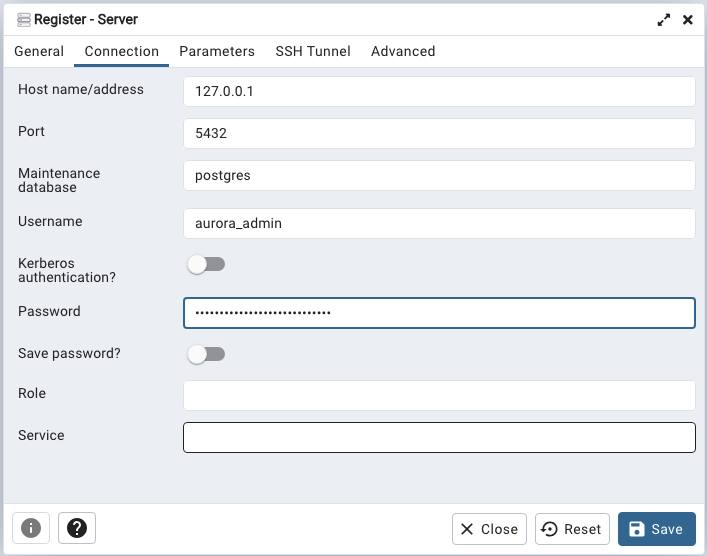

# Securely connect to an Amazon RDS
> Based on [aws article](https://aws.amazon.com/blogs/database/securely-connect-to-an-amazon-rds-or-amazon-ec2-database-instance-remotely-with-your-preferred-gui/)


## Create a remote port forwarding session
```
aws ssm start-session \   
    --region us-east-1 \   
    --target <bastion instance id> \    
    --document-name AWS-StartPortForwardingSessionToRemoteHost \    
    --parameters host="<rds endpoint name>",portNumber="5432" localPortNumber="5432"
```
## Connect using PGAdmin
Use username and password from AWS Secrets Manager




<!-- BEGIN_TF_DOCS -->
## Requirements

| Name | Version |
|------|---------|
| <a name="requirement_terraform"></a> [terraform](#requirement\_terraform) | >= 1.0 |
| <a name="requirement_aws"></a> [aws](#requirement\_aws) | >= 4.0 |
| <a name="requirement_local"></a> [local](#requirement\_local) | >= 2.4.0 |

## Providers

| Name | Version |
|------|---------|
| <a name="provider_aws"></a> [aws](#provider\_aws) | >= 4.0 |

## Modules

No modules.

## Resources

| Name | Type |
|------|------|
| [aws_iam_instance_profile.bastion_host_instance_profile](https://registry.terraform.io/providers/hashicorp/aws/latest/docs/resources/iam_instance_profile) | resource |
| [aws_iam_role.bastion_host_role](https://registry.terraform.io/providers/hashicorp/aws/latest/docs/resources/iam_role) | resource |
| [aws_iam_role_policy_attachment.bastion_host_role_policy](https://registry.terraform.io/providers/hashicorp/aws/latest/docs/resources/iam_role_policy_attachment) | resource |
| [aws_instance.bastion_host](https://registry.terraform.io/providers/hashicorp/aws/latest/docs/resources/instance) | resource |
| [aws_ami.amazon_linux_2_ssm](https://registry.terraform.io/providers/hashicorp/aws/latest/docs/data-sources/ami) | data source |
| [aws_caller_identity.current](https://registry.terraform.io/providers/hashicorp/aws/latest/docs/data-sources/caller_identity) | data source |
| [aws_security_groups.vpc_endpoint_sg](https://registry.terraform.io/providers/hashicorp/aws/latest/docs/data-sources/security_groups) | data source |
| [aws_subnets.private](https://registry.terraform.io/providers/hashicorp/aws/latest/docs/data-sources/subnets) | data source |
| [aws_vpc.vpc](https://registry.terraform.io/providers/hashicorp/aws/latest/docs/data-sources/vpc) | data source |

## Inputs

| Name | Description | Type | Default | Required |
|------|-------------|------|---------|:--------:|
| <a name="input_vpc_name"></a> [vpc\_name](#input\_vpc\_name) | vpc\_name | `string` | `"main-vpc"` | no |

## Outputs

No outputs.
<!-- END_TF_DOCS -->